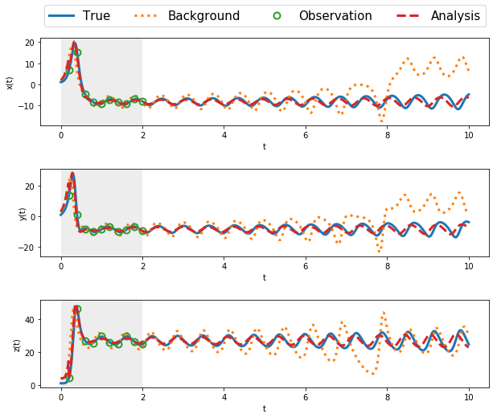

# Ensemble Kalman Filter for Lorenz63 System

We analyze the Lorenz63 system of nonlinear ODEs

$$
\begin{align}
	 \frac{\mathrm{d} x}{\mathrm{d} t} &= -\sigma(x-y), \nonumber  \\
	\frac{\mathrm{d} y}{\mathrm{d} t}  &= \rho x-y-xz,  \label{eq:lorenz} \\
	\frac{\mathrm{d} z}{\mathrm{d} t}  &= xy -\beta z,   \nonumber
\end{align}
$$


where $x=x(t),$ $y=y(t)$, $z=z(t)$ and $\sigma$ (ratio of kinematic viscosity divided by thermal diffusivity),
$\rho$ (measure of stability) and  $\beta$ (related to the wave number) are parameters. Chaotic behavior is obtained when the parameters are chosen as

$$
  \sigma = 10,\quad \rho=28,\quad \beta = 8/3.
$$

This system is a simplified model for atmospheric convection and is an excellent example of the lack of predictability. It is ill-posed  in the sense of Hadamard.


```python
import numpy as np
import matplotlib.pyplot as plt

def Lorenz63(state,*args): #Lorenz 63 model
    sigma = args[0]
    beta = args[1]
    rho = args[2]
    x, y, z = state #Unpack the state vector
    f = np.zeros(3) #Derivatives
    f[0] = sigma * (y - x)
    f[1] = x * (rho - z) - y
    f[2] = x * y - beta * z
    return f 

def RK4(rhs,state,dt,*args):
    
    k1 = rhs(state,*args)
    k2 = rhs(state+k1*dt/2,*args)
    k3 = rhs(state+k2*dt/2,*args)
    k4 = rhs(state+k3*dt,*args)

    new_state = state + (dt/6)*(k1+2*k2+2*k3+k4)
    return new_state

def EnKF(ubi,w,ObsOp,JObsOp,R,B):
    
    # The analysis step for the (stochastic) ensemble Kalman filter 
    # with virtual observations

    n,N = ubi.shape # n is the state dimension and N is the size of ensemble
    m = w.shape[0] # m is the size of measurement vector

    # compute the mean of forecast ensemble
    ub = np.mean(ubi,1)    
    # evaluate Jacobian of observation operator at ub
    Dh = JObsOp(ub)
    # compute Kalman gain
    D = Dh@B@Dh.T + R
    K = B @ Dh.T @ np.linalg.inv(D)
        
    
    wi = np.zeros([m,N])
    uai = np.zeros([n,N])
    for i in range(N):
        # create virtual observations
        wi[:,i] = w + np.random.multivariate_normal(np.zeros(m), R)
        # compute analysis ensemble
        uai[:,i] = ubi[:,i] + K @ (wi[:,i]-ObsOp(ubi[:,i]))
        
    # compute the mean of analysis ensemble
    ua = np.mean(uai,1)    
    # compute analysis error covariance matrix
    P = (1/(N-1)) * (uai - ua.reshape(-1,1)) @ (uai - ua.reshape(-1,1)).T
    return uai, P
```

## Parameters


```python
sigma = 10.0     
beta = 8.0/3.0
rho = 28.0     
dt = 0.01
tm = 10
nt = int(tm/dt)
t = np.linspace(0,tm,nt+1)
```

## Twin experiment


```python
def h(u):
    w = u
    return w

def Dh(u):
    n = len(u)
    D = np.eye(n)
    return D


u0True = np.array([1,1,1]) # True initial conditions
np.random.seed(seed=1)
sig_m = 0.15  # standard deviation for measurement noise
R = sig_m**2*np.eye(3) #covariance matrix for measurement noise

dt_m = 0.2 #time period between observations
tm_m = 2 #maximum time for observations
nt_m = int(tm_m/dt_m) #number of observation instants

ind_m = (np.linspace(int(dt_m/dt),int(tm_m/dt),nt_m)).astype(int)
t_m = t[ind_m]

#time integration
uTrue = np.zeros([3,nt+1])
uTrue[:,0] = u0True
km = 0
w = np.zeros([3,nt_m])
for k in range(nt):
    uTrue[:,k+1] = RK4(Lorenz63,uTrue[:,k],dt,sigma,beta,rho)
    if (km<nt_m) and (k+1==ind_m[km]):
        w[:,km] = h(uTrue[:,k+1]) + np.random.normal(0,sig_m,[3,])
        km = km+1
```

## Data Assimilation


```python
u0b = np.array([2.0,3.0,4.0])

sig_b= 0.1
B = sig_b**2*np.eye(3)
Q = 0.0*np.eye(3)

#time integration
ub = np.zeros([3,nt+1])
ub[:,0] = u0b
ua = np.zeros([3,nt+1])
ua[:,0] = u0b

n = 3 #state dimension
m = 3 #measurement dimension

# ensemble size 
N = 10
#initialize ensemble
uai = np.zeros([3,N])
for i in range(N):
    uai[:,i] = u0b + np.random.multivariate_normal(np.zeros(n), B)

km = 0
for k in range(nt):
    # Forecast Step
    #background trajectory [without correction]
    ub[:,k+1] = RK4(Lorenz63,ub[:,k],dt,sigma,beta,rho) 
    #EnKF trajectory [with correction at observation times]
    for i in range(N): # forecast ensemble
        uai[:,i] = RK4(Lorenz63,uai[:,i],dt,sigma,beta,rho) \
                 + np.random.multivariate_normal(np.zeros(n), Q)

    # compute the mean of forecast ensemble
    ua[:,k+1] = np.mean(uai,1)
    # compute forecast error covariance matrix
    B = (1/(N-1)) * (uai - ua[:,k+1].reshape(-1,1)) @ (uai - ua[:,k+1].reshape(-1,1)).T

    if (km<nt_m) and (k+1==ind_m[km]):
        # Analysis Step
        uai,B = EnKF(uai,w[:,km],h,Dh,R,B)
        # compute the mean of analysis ensemble
        ua[:,k+1] = np.mean(uai,1)    
        km = km+1
```

## Output

We plot the trajectories of $x,$ $y$ and $z$ as a function of time $t.$


```python
fig, ax = plt.subplots(nrows=3,ncols=1, figsize=(10,8))
ax = ax.flat

for k in range(3):
    ax[k].plot(t,uTrue[k,:], label='True', linewidth = 3)
    ax[k].plot(t,ub[k,:], ':', label='Background', linewidth = 3)
    ax[k].plot(t[ind_m],w[k,:], 'o', fillstyle='none', \
               label='Observation', markersize = 8, markeredgewidth = 2)
    ax[k].plot(t,ua[k,:], '--', label='Analysis', linewidth = 3)
    ax[k].set_xlabel('t')
    ax[k].axvspan(0, tm_m, color='lightgray', alpha=0.4, lw=0)

ax[0].legend(loc="center", bbox_to_anchor=(0.5,1.25),ncol =4,fontsize=15)

ax[0].set_ylabel('x(t)', labelpad=5)
ax[1].set_ylabel('y(t)', labelpad=-12)
ax[2].set_ylabel('z(t)')
fig.subplots_adjust(hspace=0.5)

plt.savefig('L63_EnKF.eps', dpi = 500, bbox_inches = 'tight')
```


    

    


## Conclusions

1. The EnKF does a remarkable job, and there is no evidence of filter divergence in spite of the ill-posedness of the dynamic system. We begin to see a slight phase shift in the forecast, starting around $t=8.$ Usually, by this time, we will have new observations and the forecast can then be reinitialized and updated.  This example was adapted from the original in Ahmed2020.

2. Ensemble methods have gained significant popularity because of their simple conceptual formulation and relative ease of implementation. No optimization problem is required to be solved. They are considered non-intrusive in the sense that current solvers can be easily incorporated with minimal modification, as there is no need to derive model Jacobians or adjoint equations.

3. Despite the sound mathematical and theoretical foundation of standard Kalman filters (both linear and nonlinear cases), they are not widely utilized in geophysical sciences. The major bottleneck in the computational pipeline of Kalman filtering is the update of background covariance matrix. In typical implementation, the cost of this step is $O(n^3),$ where $n$ is the size of the state vector. Though still manageable for systems of ODEs, hhis becomes prohibitive for PDE systems, usually having dimensions of $10^6$ to $10^9$ unknowns.


```python

```
